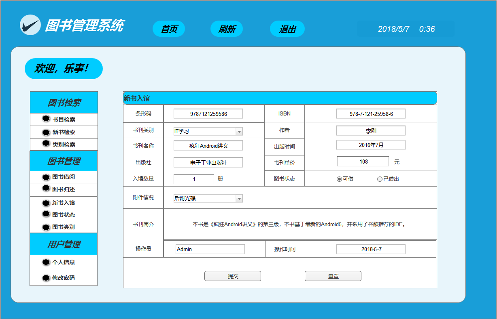
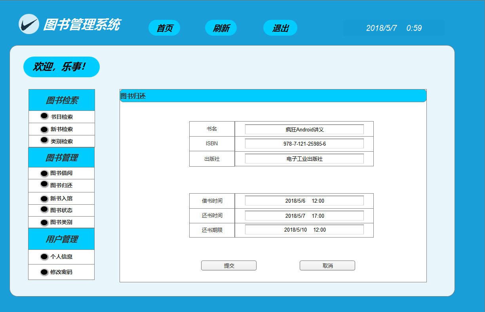

# 实验5 图书管理系统数据库设计与界面设计
|    学号    |       班级       |      姓名     |    照片    | 
|:-------:|:------------- | ----------:|----------:|
|   201510414329  |     2015级3班    |   朱根来   |   |
## 一、全部数据表设计如下
##1.数据表
## 1.1.图书表
|字段|类型|长度|允许空值|主键|说明|
|:-------:|:-------------:|:------:|:----:|:---:|:-----|
|book_id|char|7|否|KEY||
|book_name|varchar|32|否||书籍名称|
|book_type|tinyint|1|否||类型|
|author|varchar|5|是||作者|
|press|varchar|20|是||出版社|
|publish_date|date||是||出版日期|
|price|double||否||单价|
|register_time|timestamp||否||入库日期|
|is_borrow|tinyint|1|否||是否可借|

## 1.2. 借书者表
|字段|类型|长度|允许空值|主键|说明|
|:-------:|:-------------:|:------:|:----:|:---:|:-----|
|id|int||否|KEY|用户id|
|student_id|char|11|否||学号|
|account|varchar|15|否||用户名|
|password|char|32|否||密码|
|name|varchar|5|否||真实姓名|
|head_image|varchar|100|是||头像|
|sex|tinyint|1|否||性别|
|birthday|date||是||出生日期|
|borrow_number|tinyint|1|否||已借数量|
|register_time|timestamp||否||注册时间|


## 1.3. 借书归还表
|字段|类型|长度|允许空值|主键|说明|
|:-------:|:-------------:|:------:|:----:|:---:|:-----|
|borrow_id|int||否|KEY|借书号|
|book_id|char|7|否|KEY||
|borrow_time|timestamp||否||借阅时间|
|should_r_time|timestamp||否||应还时间|
|is_return|tinyint|1|否||是否归还|
|return_time|timestamp||否||归还时间|


## 2. 界面设计
## 2.1. 登录界面设计

## 2.2. 添加图书界面设计


## 2.3. 还书界面设计


- 用例图参见：还书用例
- 类图参见：还书图书类
- 顺序图参见：还书顺序图
- API接口如下：

1. 接口调用请求说明

- 功能：用于获取全部分类
- 支持格式:json/xml
- 请求地址：http://api.yi18.net/book/bookclass
- 请求示例:请求示例：http://api.yi18.net/book/search?keyword=资本论
- 请求方法：GET
- 请求参数： Allow

|参数名称|必填|说明|
|:-------:|:-------------: | :----------:|
|access_token|是|用于验证请求合法性的认证信息。 |
|method|是|固定为 “GET”|

- 返回实例：
```
{
    "info": "添加成功",
    "data": {
        "Bar_code": "9787121259586",
        "Category": "IT学习",
        "Bookname": "疯狂Android讲义",
        "Publisher": "电子工业出版社",
        "Number": "1",
        "Accessory": "后附光碟",
        "Price": "108",
        "Intro": "本书是《疯狂Android讲义》的第三版，本书基于最新的Android5，并采用谷歌推荐的IDE",
        "Author": "李刚",
        "ISBN": "978-7-121-25958-6",
        "Price": "108",
        "publish_time": "2016年7月",
    },
    "code": 200
}
```
- 返回参数说明：
    
|参数名称|说明|
|:-------:|:-------------: |
|result|返回信息|
|data|获取的图书信息|
|200|返回码|