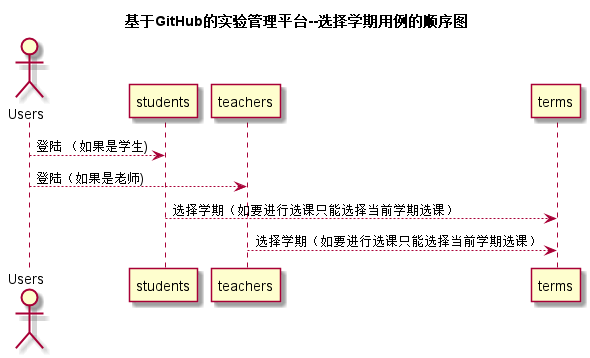

# “选择学期”用例 [返回](./README.md)
## 1. 用例规约

|用例名称|选择学期|
|-------|:-------------|
|功能|用户登录之后可以选择在校的任一学期，可以查看之前实验成绩，若要选课只能在当前学期。|
|参与者|学生，老师|
|前置条件|学生，老师需要先登录|
|后置条件| 选择完学期之后自动跳转到显示课程页面 |
|主流事件| 首页点击选择学期下拉列表选择相应学期|
|备注| |

## 2. 业务流程（顺序图） [源码](../src/玄学其.puml)
 

## 3. 界面设计
- 界面参照: 
- API接口调用
   - 接口1：[select_terms](../接口/select_terms.md)
## 4. 算法描述（活动图）

## 5. 参照表

- students
- teachers
- terms

